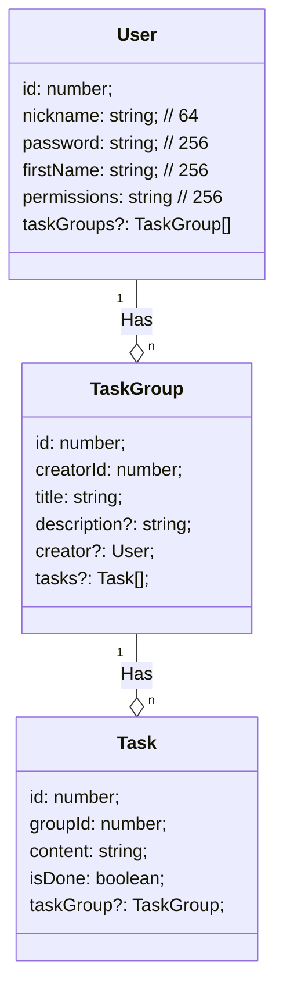

```mermaid
classDiagram

class User {
    id: number;
    nickname: string; // 64
    password: string; // 256
    firstName: string; // 256
    permissions: string // 256

    taskGroups?: TaskGroup[]
}

User "1" --o "n" TaskGroup : Has

class TaskGroup {
  id: number;
  creatorId: number;
  title: string;
  description?: string;

  creator?: User;
  tasks?: Task[];
}

TaskGroup "1" --o "n" Task : Has

class Task {
  id: number;
  groupId: number;
  content: string;
  isDone: boolean;

  taskGroup?: TaskGroup;
}

```
